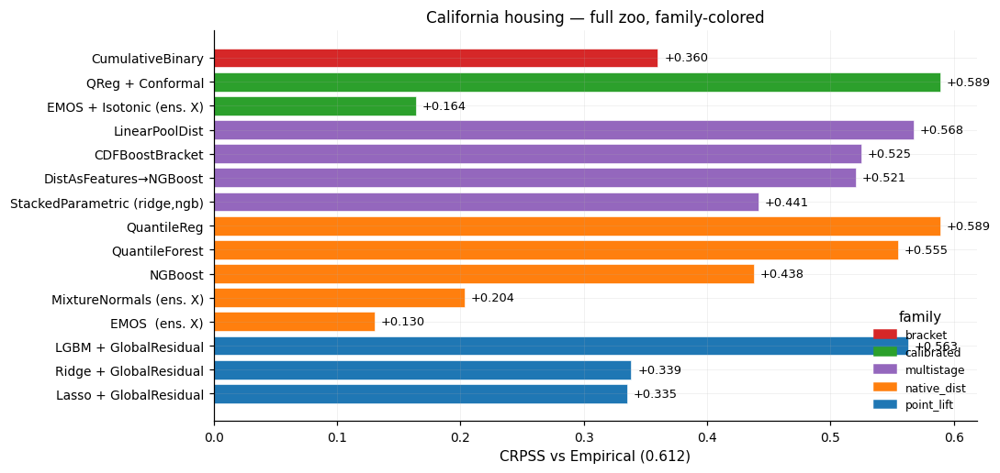

# bracketlearn


**A scikit-learn-style toolkit for estimating the predictive distribution of a
scalar outcome and pricing the prediction-market contracts written on it.**

```bash
pip install -e ".[demo]"
python -m bracketlearn.examples.value_vs_accuracy_weather
```

## Worked result

The package fits a distributional model, prices it onto a venue's bracket
ladder, and scores the resulting prices two ways: for **accuracy**, the
distance from the realized outcome, and for **value**, whether the deviations
from the quoted price are directionally correct. The bundled example runs this
on 5,429 station-days of Kalshi weather contracts (2026-03-17 to 2026-09-03,
18 stations, chronological 60/40 split):

```
===== HIGH  (train 1737, test 1158) =====
  forecast                        Brier   EA x100
  reference (market)             0.1066    0.0000
  EMOS (raw)                     0.1257   -0.0487   <- less accurate than market
  EMOS + mean de-bias            0.1256   -0.0588   <- Brier falls, EA falls
  EMOS + edge-recal              0.1069   +0.0042   <- Brier falls, EA rises
  EA 95% CI (clustered by station-day): [-0.1708, +0.0779]  (crosses zero)
```

The two calibration adjustments move Brier and Edge-Alignment in opposite
directions. The mean de-bias leaves Brier essentially unchanged while lowering
EA; the edge recalibration improves both. Accuracy and value are therefore
distinct orderings over the same forecasts, which is the property the
[Edge-Alignment metric](docs/guides/value_vs_accuracy.md) is constructed to
measure, and the reason a leaderboard ranked by Brier can select the wrong
model for a trading application.

On this sample EMOS is less accurate than the market and its EA is negative,
with a bootstrap interval that contains zero. Section 5b of the value guide
gives the decomposition, including the correction of an earlier result computed
against a fixture whose bracket edges were wrong.



## Problem statement

Let `Y` be a continuous outcome (tomorrow's high temperature, a game's final
margin, the next GDP print) with features `X`. A prediction-market contract
pays a known function `g(Y) ∈ {0, 1}` of that outcome, so its risk-neutral fair
price is the conditional expectation `E[g(Y) | X]`, a functional of the
conditional predictive distribution `F(y | X) = P(Y ≤ y | X)`. Every contract a
venue lists reduces to one such functional:

| Contract | Payoff `g(Y)` | Fair price as a functional of `F` |
|---|---|---|
| Bracket `[a, b)` | `1[a ≤ Y < b]` | `F(b) − F(a)` |
| Threshold above `k` | `1[Y > k]` | `1 − F(k)` |
| Threshold below `k` | `1[Y ≤ k]` | `F(k)` |
| Twin (paired) at `k` | `(1[Y ≤ k], 1[Y > k])` | `(F(k), 1 − F(k))` |

Pricing a venue therefore decomposes into two estimands: the predictive
distribution `F(· | X)`, and the functionals of `F` that the listed contracts
select. bracketlearn estimates the first and evaluates the second, then scores
both against realized outcomes with proper scoring rules.

## Relation to existing libraries

The first estimand above is well served. The second is not, and the gap is the
reason this package exists.

| Library | Provides | Does not provide |
|---|---|---|
| NGBoost, `sklearn.QuantileRegressor`, quantile-forest | a conditional distribution or its quantiles | contract pricing; scoring against a reference price |
| `properscoring`, `scoringrules` | CRPS, log score, Brier on arrays | a typed distribution object; per-row contract ladders |
| statsmodels | inference for parametric models | distributional CV, bracket adapters |
| MAPIE, crepes | conformal prediction intervals | full `F`, and the functionals a venue lists |

Composing those covers the forecasting half. What remains is the part specific
to prediction markets: mapping `F(· | X)` onto a venue's listed contracts,
including the per-row rotating ladders Kalshi relists daily, and scoring the
resulting prices both for accuracy against the outcome and for value against
the quoted price. A distribution that is closer to the truth is not always the
one with more edge over the market, and the two orderings can disagree; §5 of
the [value guide](docs/guides/value_vs_accuracy.md) constructs a case where
they do.

If the goal is a predictive distribution and nothing else, NGBoost or
quantile-forest is the shorter path, and this package will call them for you as
`SklearnPoint` / `NGBoostNormal` / `QuantileForest` stages.

## Install

bracketlearn has not reached PyPI yet. Install from source:

```bash
git clone https://github.com/FrederikBenirschke/bracket-learn
pip install -e ./bracket-learn

# With the full set of optional trainers (LightGBM, NGBoost, torch, ...):
pip install -e "./bracket-learn[demo]"
```

After PyPI publication the install becomes `pip install bracket-learn` or
`pip install "bracket-learn[demo]"`.

## Quickstart: the three steps end to end

This one script runs all three steps: generate synthetic weather features, fit
EMOS (step 1), price the four contract shapes a venue lists (step 2), then score
the fair prices against what happened (step 3). Each building block gets its own
section after this.

```python
import numpy as np
from bracketlearn import EMOS, BracketLadder, BinaryAbove, Twin
from bracketlearn.score import brier_bracket, log_loss_bracket

# --- synthetic NYC max-temperature data ---
rng = np.random.default_rng(0)
N = 200
day = np.arange(N)
season = 70 + 15 * np.sin(2 * np.pi * day / 365.0)
prior_high = season + rng.normal(0, 4, N)
X = np.column_stack([prior_high, season])
y = season + 0.6 * (prior_high - season) + rng.normal(0, 5, N)
X_tr, X_te, y_tr, y_te = X[:150], X[150:], y[:150], y[150:]

# --- step 1: fit EMOS (ensemble-mean + spread regression) ---
emos = EMOS().fit(X_tr, y_tr)
dist = emos.predict_dist(
    X_te,
    ids=np.arange(50),
    timestamps=np.arange(50, dtype=float),
)
# dist.params["mu"], dist.params["sigma"] now hold (50,) forecasts.

# --- step 2: price the contracts you'd see on a prediction market ---

# (1) Single threshold: "high above 75°F today"
fair_above_75 = BinaryAbove(strike=75.0).price(dist).fair_price
# fair_above_75[i] = model P(high_i > 75); feed this into your own
# trading layer alongside whatever quotes you scraped from the venue.

# (2) Paired YES/NO at 70°F (spread / total style)
twin = Twin(strike=70.0).price(dist)
yes = twin.fair_price[twin.contract_ids == 0][0]
no  = twin.fair_price[twin.contract_ids == 1][0]
print(f"Twin(70)  yes={yes:.3f}  no={no:.3f}  (sum=1.000)")

# (3) Bracket ladder, shared edges across all rows (Polymarket weekly style):
edges = np.array([0.0, 60.0, 70.0, 80.0, 90.0, 100.0])
ladder = BracketLadder(edges_per_row=[edges] * 50).price(dist)
# 5 contracts per entity: P([0,60)), P([60,70)), P([70,80)), ...

# (4) Bracket ladder, edges varying per row (Kalshi daily-rotating style):
edges_per_day = [
    np.array([mu - 10, mu - 3, mu, mu + 3, mu + 10])
    for mu in dist.params["mu"]
]
per_row = BracketLadder(
    edges_per_row=edges_per_day,
    include_tail_buckets=True,      # add "below" and "above" rows
).price(dist)
# Per-entity rows sum to exactly 1.0.

# --- step 3: score the fair prices against the realized outcomes ---
# Brier / log-loss on the bracket: are the fair prices calibrated?
print(f"BracketLadder Brier:    {brier_bracket(ladder, edges, y_te):.4f}")
print(f"BracketLadder log-loss: {log_loss_bracket(ladder, edges, y_te):.4f}")
```

Output for the first entity:

```
Twin(70)  yes=0.912  no=0.088  (sum=1.000)

BracketLadder fair prices for entity 0 (shared edges):
    [0, 60)   = 0.000
    [60, 70)  = 0.088
    [70, 80)  = 0.635
    [80, 90)  = 0.271
    [90, 100) = 0.006

BracketLadder (per-row edges centered on each day's forecast):
    < 67.0          = 0.026
    [67.0, 74.0)    = 0.254
    [74.0, 77.0)    = 0.220
    [77.0, 80.0)    = 0.220
    [80.0, 87.0)    = 0.254
    > 87.0          = 0.026
                sum = 1.000

BracketLadder Brier:    0.4684
BracketLadder log-loss: 0.7950
```

Full walkthrough with output: [Quickstart guide](docs/guides/quickstart.md).

## Step 1: forecast a distribution

Everything starts with a `DistributionForecast`, a typed predictive density over
the underlying number. You build one by chaining stages into a `Pipeline` and
running it under `WalkForward`. This section covers how models compose, the
distribution types they emit, and the trainer families you pick from.

### Compose models with Pipeline and WalkForward

```python
import numpy as np
from sklearn.linear_model import RidgeCV

from bracketlearn import Pipeline, WalkForward
from bracketlearn.lift import GlobalResidual, Isotonic
from bracketlearn.trainers import EMOS, QuantileReg, SklearnPoint

edges = np.linspace(0, 100, 11)   # 10 brackets

# Each model is a Pipeline (a sequential chain of stages); names are labels.
ridge = Pipeline([SklearnPoint(RidgeCV()), GlobalResidual()], name="ridge")
emos = Pipeline([EMOS(), Isotonic(pre_integrate_edges=edges)], name="emos")
qreg = Pipeline([QuantileReg(n_estimators=100)], name="qreg")

# WalkForward is the CV/OOF driver. Pass one model or a list of them.
wf = WalkForward(cv="expanding-window", n_folds=5, refit_on_full=True)
result = wf.fit_predict([ridge, emos, qreg], X, y, ids=ids, timestamps=ts)

# Distribution-level metrics on OOF predictions.
print(result.to_table(y, metrics=["crps", "log_score", "pit"]))

# Bracket-contract metrics: pass the shared edge vector; the result builds
# the per-row bracket ladder internally per stage.
print(result.to_table(y, metrics=["log_loss_bracket", "brier_bracket"],
                      edges=edges))

# Predict on unseen data using each model's full-train refit.
new_dists = wf.predict(X_new, ids=new_ids, timestamps=new_ts)
```

### The sklearn contract

Every forecaster, lifter, and calibrator inherits from `BaseEstimator` and
supports `get_params`, `set_params`, and `clone()`. `WalkForward` clones each
model before every fold's fit, so your instances stay unmutated and you reuse
them across runs.

**What "sklearn-style" does not mean here:** these estimators are *not*
`sklearn.utils.estimator_checks.check_estimator`-compliant, and are not
intended to be. A `DistForecaster` returns a typed `DistributionForecast`
rather than an array, which several of sklearn's checks require. What is
borrowed is the parameter protocol (`get_params`/`set_params`/`clone`), the
compose-and-cross-validate shape, and the naming, not API-level
substitutability inside sklearn's own meta-estimators.

### The five protocols

| Protocol          | Input → Output                                | Examples                                                       |
|-------------------|-----------------------------------------------|----------------------------------------------------------------|
| `PointForecaster` | `X → PointForecast` (μ̂)                     | `SklearnPoint(Ridge())`, `OnlineAggregator`, `RNNHourly`       |
| `DistForecaster`  | `X → DistributionForecast`                    | `EMOS`, `NGBoostNormal`, `QuantileReg`, `CumulativeBinary`     |
| `Lifter`          | `PointForecast → DistributionForecast`        | `GlobalResidual`, `StudentTResidual`, `GARCHResidual`          |
| `Calibrator`      | `DistributionForecast → DistributionForecast` | `Isotonic`, `ConformalCalibrate`                               |
| `ContractAdapter` | `DistributionForecast → ContractForecast`     | `BinaryAbove`, `BinaryBelow`, `Twin`, `ThresholdLadder`, `BracketLadder` |

List stages in a `Pipeline` and it wires them left-to-right by protocol type. A
`PointForecaster` followed by a `Lifter` becomes a `DistForecaster`; add a
`Calibrator` and it stays one. For parallel ensembling, wrap upstream `Pipeline`
objects in a `Stacker`. `WalkForward` drives the CV and OOF. Names label the
leaderboard; they never wire anything.

### Distribution backings and estimator families

A `DistributionForecast` carries an explicit backing. Normal, Student-t,
mixture, quantile, or bracket, and every backing answers `cdf`, `crps`,
`pit`, `integrate` and `log_score`. Which trainers emit which backing, what
each is for, and when to prefer one over another: **[Catalog](docs/guides/catalog.md)**.

## Step 2: price the contracts

You have a `DistributionForecast`. A `ContractAdapter` reads fair prices off it
for the exact contracts a venue lists. The Quickstart used `BinaryAbove`,
`Twin`, and `BracketLadder`; here is the full set, with each adapter mapped to
the venue shape it prices.

### Adapter catalogue

| Adapter                | Pricing                            | Maps to (examples)                                          |
|------------------------|------------------------------------|-------------------------------------------------------------|
| `BinaryAbove(k)`       | `P(X > k)`                         | Kalshi "high above 80°F", "S&P > 5000 by Friday"            |
| `BinaryBelow(k)`       | `P(X ≤ k)`                         | Kalshi "GDP ≤ 2.5%", "low below freezing"                   |
| `Twin(k)`              | paired `P(X > k)` / `P(X ≤ k)`     | Polymarket spread (`Eagles -3.5`), total (`Over 47.5`)      |
| `ThresholdLadder(ks)`  | `[P(X > k_i)]` per strike          | Kalshi multi-threshold temperature ladders                  |
| `BracketLadder(edges_per_row)` | `[P(lo ≤ X < hi)]` per-row edges | Kalshi daily-rotating brackets; Polymarket weather brackets (pass `[edges]*N`) |

All five adapters take any `DistributionForecast` (normal, student-t,
mixture-normal, quantile, or bracket backing) and return a long-form
`ContractForecast` carrying `fair_price`, `entity_ids`, `group_id`,
`contract_spec`, and provenance.

### Worked mapping: Kalshi NYC temperature

Kalshi runs a daily-rotating bracket ladder on NYC max temperature. The
brackets shift every day: Monday lists `{<60, 60–65, 65–70, …}`, Tuesday
`{<58, 58–62, 62–66, …}`. The mapping:

| Venue                                       | Library                                                                  |
|---------------------------------------------|--------------------------------------------------------------------------|
| Underlying = today's NYC max temp (°F)      | `y` is a length-N vector of realized temps                               |
| One ladder per day, edges differ            | `edges_per_row[i]` = day `i`'s edges                                     |
| 5–7 mutually-exclusive YES contracts        | `BracketLadder(edges_per_row=..., include_tail_buckets=True)`            |
| Outermost `< X` and `> Y` "tail" contracts  | `include_tail_buckets=True` adds them; per-entity rows then sum to 1.0   |
| YES pays $1 if temp falls in bracket        | `fair_price` is `P(lo ≤ temp < hi)` for that row                         |
| Calibration check after settlement          | `score.brier_bracket(contracts, edges, y)` on the realized temps         |

When every day shares one edge set (Polymarket weekly weather contracts), pass
`edges_per_row=[edges] * N`. The inner list holds N references to the same
array, so it costs no extra memory.

### Worked mapping: spread / total markets

An NFL spread of "Eagles −3.5" pays YES when `(Eagles − opp) > 3.5`. A total of
"Over 47.5" pays YES when `(Eagles + opp) > 47.5`. Both are single-strike
binaries with paired YES/NO sides:

| Venue                                        | Library                                            |
|----------------------------------------------|----------------------------------------------------|
| Underlying = signed margin (spread)          | `y` is the realized margin per game                |
| Underlying = total points (total)            | `y` is the realized total per game                 |
| Strike = the spread / total number           | `Twin(strike=3.5)` / `Twin(strike=47.5)`           |
| YES and NO sides quoted separately on venue  | Two rows per game, shared `group_id`               |
| YES + NO sum to 1 by construction            | `Twin` rows always sum to 1 within a game          |
| Calibration check after settlement           | `score.log_loss_bracket(...)` on the YES/NO ladder |

For multi-strike lines ("Eagles −3, −3.5, −4"), price the same `dist` through
several `Twin` instances at different strikes. For a one-sided Kalshi
temperature ladder ("above 70", "above 75", "above 80"), use
`ThresholdLadder(strikes=[70, 75, 80])`. It returns survival probabilities at
rising strikes: monotone, and they don't sum to 1.

## Step 3: score the prices

With fair prices in hand, check them against what settled. bracketlearn scores
on two levels, both through `result.to_table(y, metrics=[...])` on a
`WalkForward` run:

- **Distribution metrics** read the predictive density directly: `crps`,
  `log_score`, and `pit`.
- **Contract metrics** read the priced ladder: `brier_bracket` and
  `log_loss_bracket`, each taking `edges=` in any of the three shapes
  `integrate` accepts, a shared `(B+1,)` vector, a dense `(N, B+1)` grid, or a
  ragged per-row sequence. On a rotating ladder pass the per-row edges the
  ladder was priced with; the scorers raise if handed one row's vector
  instead. They answer the
  practical question, were the bracket prices calibrated.

The standalone `score.brier_bracket` and `score.log_loss_bracket` helpers, used
in the [Quickstart](#quickstart-the-three-steps-end-to-end), score a single
`ContractForecast` directly. The docs cover the per-backing scoring math.

### Accuracy is not value

The metrics above ask "are my prices **calibrated**?": close to the realized
outcome. A trader asks a second question: "are my prices more **valuable** than
the one already quoted?" That is graded against a *reference price* `m` (a market
quote or baseline), not against truth. A more accurate price can be worth less.
`score.edge_alignment(q, m, r)` measures value (the
expected betting payoff `(q−m)(r−m)`), and `score.value_report` splits a change
in value into "how much mispricing was available" vs "how much your forecast
failed to capture." This is still scoring, not a trade decision; the
[value-vs-accuracy guide](docs/guides/value_vs_accuracy.md) derives
the principle and shows a benign case where the two metrics disagree.

You can also **train for value** directly. `bracketlearn.value` holds two
bracket trainers, `BlendedBracketGBM` (LightGBM) and `BlendedBracketNet`
(torch), that optimize `L = CE − λ·EA`: calibration tilted toward capturing the
reference's mispricing. They take the reference price `m` at fit time (the one
thing that separates them from the core forecasters, hence their own module),
and you select the tilt `λ` by *costed* value, since fee-free EA over-tilts;
see the [value-with-fees](docs/guides/value_with_fees.md) and
[value-trainers](docs/guides/value_trainers.md) guides. Still a price, not a
position: the trade layer remains yours.

## Operating the pipeline

The sections above cover a single fit. These control how `WalkForward` runs
across folds and how the pipeline scales to more data, more sites, and more
targets.

Covered in the guides rather than here, because each has more detail than a
README should carry:

| Topic | Guide |
|---|---|
| Expanding / rolling window, embargo, purging | [cv.md](docs/guides/cv.md) |
| Sample weights and recency decay | [weights.md](docs/guides/weights.md) |
| Cross-site partial pooling | [concepts.md](docs/guides/concepts.md) |
| Multi-target (HIGH and LOW together) | [multitarget.md](docs/guides/multitarget.md) |
| Hyperparameter search | [search.md](docs/guides/search.md) |
| Saving and loading fitted pipelines | [persistence.md](docs/guides/persistence.md) |

## Out of scope: trade decisions

bracketlearn stops at the fair price. Turning `fair_price` into a position size
stays out, by design. That step holds your private signal: side selection on
correlated ladders, edge gates tuned to liquidity, group Kelly across a bracket,
fee schedules, queue assumptions. Ship a default and it lands wrong for the next
user or leaks the edge of the one who had it. You get the calibrated fair price.
You write the trading layer.

## Status and test suite

Version 0.8.0, pre-PyPI. 12,355 lines across the package, 472 tests in 37
files, `mypy --strict` on the gated modules, and a CI job that installs the
built wheel into a clean virtualenv and imports it.

The suite is written against past defects rather than for coverage. Several
tests exist because the corresponding bug shipped:

| Test | Property it pins |
|---|---|
| `test_readme_headline_is_current.py` | the numbers in this README match what the example prints, parsed from its stdout |
| `test_pipeline_calibration_oof.py` | the calibrator and the transformers above it never see the tail they are calibrated on |
| `test_stacker_inner_oof.py` | a stack's meta receives out-of-sample upstream predictions, so it cannot learn to weight whichever upstream overfits |
| `test_bracket_scores_per_row_edges.py` | a rotating ladder is scored against each row's own edges, and passing one row's edges raises |
| `test_bootstrap_ci.py` | interval coverage is near nominal, and clustering widens the interval when clusters share a component |
| `test_no_silent_fallbacks.py` | a missing input raises rather than defaulting |
| `test_notebooks_are_stripped.py` | committed notebooks carry no output |

The README test is there because this file carried a headline number for
several weeks after the fixture behind it was found to be corrupted. Prose does
not fail a test suite; that one does.

[CHANGELOG.md](CHANGELOG.md) records the version history, the migration recipes
for past API changes, and a decomposition of every result that has moved.

## License

MIT.
