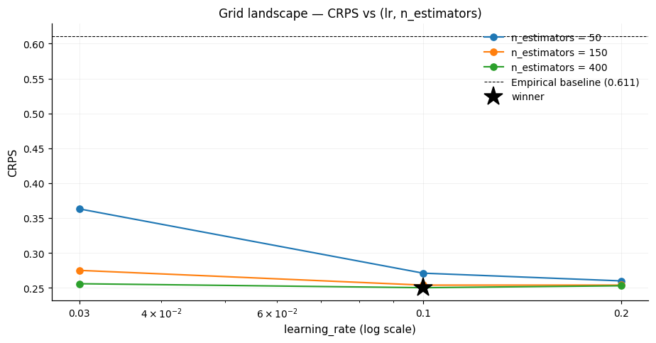

# Hyperparameter search

`GridSearch` enumerates a parameter grid, cloning the model **and** the
`WalkForward` driver per grid point so every combo is scored under the same
time-aware CV.

```python
from bracketlearn import Pipeline, WalkForward
from bracketlearn.search import GridSearch
from bracketlearn.trainers import EMOS

gs = GridSearch(
    Pipeline([EMOS()], name="emos"),
    WalkForward(cv="expanding-window", n_folds=5, refit_on_full=True),
    param_grid={
        "emos__sigma_floor": [0.3, 0.5, 1.0],
        "n_folds": [3, 5],
    },
    scoring="crps", refit_node="emos",
)
gs.fit(X, y, ids=ids, timestamps=ts)

print(gs.best_params_)        # e.g. {"emos__sigma_floor": 0.5, "n_folds": 5}
print(gs.best_score_)         # mean CRPS at that combo
gs.best_wf_.predict(X_new, ids=new_ids, timestamps=new_ts)  # refit driver
```

## Skipping sklearn.GridSearchCV

`sklearn.model_selection.GridSearchCV` re-splits the data with its own
`KFold`. That breaks time ordering and inflates OOF metrics on sequential
data. `GridSearch` runs `WalkForward`'s own `expanding-window` or
`rolling-window` CV inside each grid point, so the OOF estimates stay honest.

## Param-grid syntax

- `WalkForward`-level params (`cv`, `n_folds`, `embargo`, `rolling_window`,
  `shuffle`, `random_state`, `refit_on_full`) appear without a prefix and apply
  to the cloned driver.
- Model stage params use sklearn-style `node__field`:
  `"emos__sigma_floor"`, `"ridge__base__estimator"`, etc.

## Scoring

Built-in metrics, all losses where lower wins:

- `"crps"`: continuous ranked probability score.
- `"log_score"`: predictive negative log-likelihood.
- `"log_loss_bracket"`: bracket-contract log loss (requires `edges=`).
- `"brier_bracket"`: bracket-contract Brier (requires `edges=`).

The objective is `result.score(...)[refit_node][scoring]`. Pass
`refit_node=None` to average across all nodes, which fits a single combined
node scored on that average.

## Reading a grid



A 3x3 grid over `qreg__learning_rate` and `qreg__n_estimators` for
`QuantileReg` on California housing, from
[`grid_search_demo.ipynb`](../../notebooks/grid_search_demo.ipynb). Every
point is a full expanding-window run, and the dashed line is the empirical
baseline at CRPS 0.611.

The shape is the usual one for gradient boosting: more trees buy most of what
a higher learning rate would, so the three curves converge from the left and
the surface is nearly flat across the right half. Every grid point beats the
baseline by a wide margin, while the points within that flat region differ
from each other by far less than they differ from the baseline. A grid with
this shape is a reason to take the cheaper configuration rather than the
nominal winner, since the margin separating them is the size a different
fold split can reverse.

The committed figure was rendered before the repo-wide dash removal, so its
title still carries an em-dash that the source at
`notebooks/_src/grid_search_demo.py` no longer has. Re-running the notebook
regenerates it.
